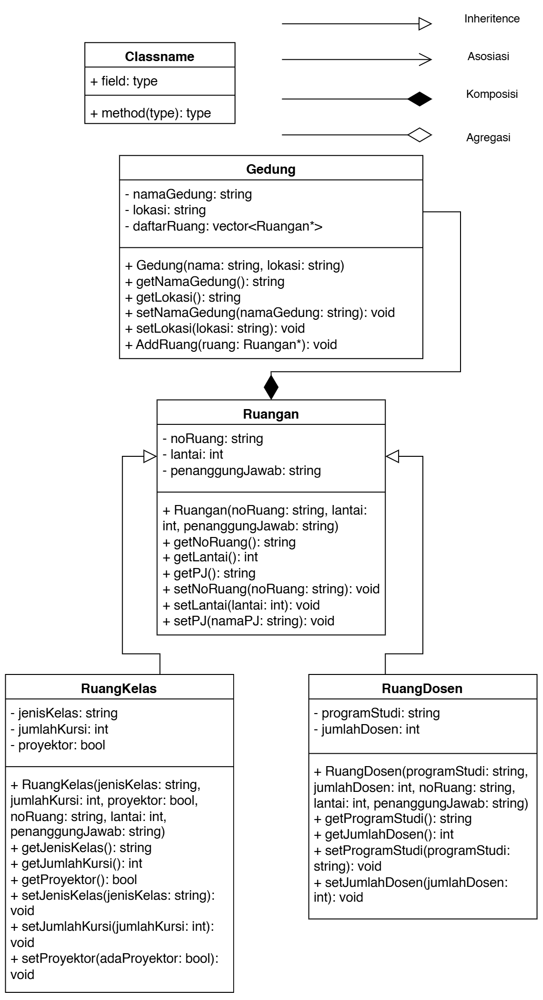
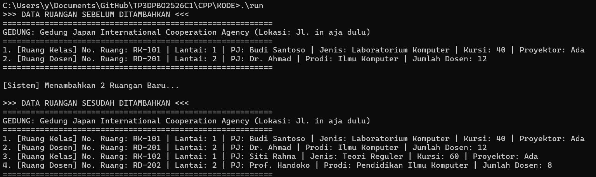
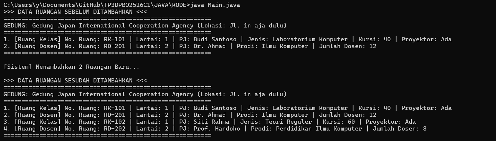
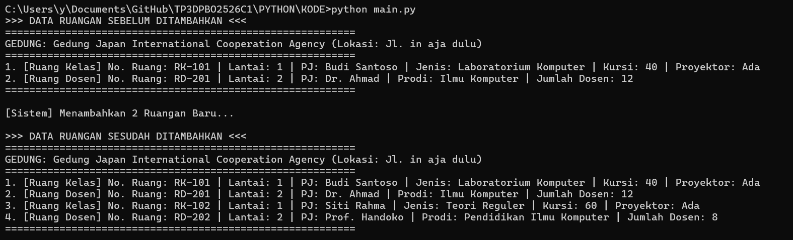

# TP3DPBO2526C1
# TP3 DPBO - Sistem Pendataan Gedung
Tugas Praktikum 3 DPBO kelas C1 dengan tema Hierarchical inheritance.
# Janji
Saya Wingko Prajna dengan NIM 2503358 mengerjakan TP 3 dalam mata kuliah Desain dan Pemrograman Berorientasi Objek untuk keberkahanNya maka saya tidak melakukan kecurangan seperti yang telah dispesifikasikan. Aamiin.

# Desain

Gedung berkomposisi dengan Ruangan, karena tanpa gedung tidak akan ada ruangan.
Lalu RuangKelas(Child) dan RuangDosen(Child) memiliki hierarchical inheritance dengan Ruangan(Parrent)

# Penjelasan Atribut dan Method Setiap Kelas, Desain Program, serta Alur Sistem

Berikut adalah penjelasan mengenai atribut dan method setiap kelas, desain program, serta alur sistem berdasarkan diagram kelas yang dilampirkan:

## 1. Penjelasan Atribut dan Method Setiap Kelas

### **A. Kelas `Gedung`**

Kelas ini mewakili sebuah gedung yang dapat menampung beberapa ruangan.

**Atribut (Private/`-`):**

| Atribut | Tipe | Keterangan |
|---------|------|------------|
| `- namaGedung` | `string` | Menyimpan nama dari gedung. |
| `- lokasi` | `string` | Menyimpan lokasi atau alamat gedung. |
| `- daftarRuang` | `vector<Ruangan*>` | Menyimpan kumpulan pointer ke objek `Ruangan` yang ada di dalam gedung tersebut. |

**Method (Public/`+`):**

| Method | Keterangan |
|--------|------------|
| `+ Gedung(nama: string, lokasi: string)` | Konstruktor untuk menginisialisasi objek gedung dengan nama dan lokasi awal. |
| `+ getNamaGedung(): string` | Mengembalikan nama gedung. |
| `+ getLokasi(): string` | Mengembalikan lokasi gedung. |
| `+ setNamaGedung(namaGedung: string): void` | Mengubah/mengatur nama gedung. |
| `+ setLokasi(lokasi: string): void` | Mengubah/mengatur lokasi gedung. |
| `+ AddRuang(ruang: Ruangan*): void` | Menambahkan pointer objek `Ruangan` baru ke dalam atribut `daftarRuang`. |

### **B. Kelas `Ruangan` (Base Class / Parent Class)**

Kelas induk dasar yang mendefinisikan informasi umum untuk semua jenis ruangan.

**Atribut (Private/`-`):**

| Atribut | Tipe | Keterangan |
|---------|------|------------|
| `- noRuang` | `string` | Menyimpan nomor atau kode ruangan. |
| `- lantai` | `int` | Menyimpan posisi lantai tempat ruangan berada. |
| `- penanggungJawab` | `string` | Menyimpan nama orang/pihak yang bertanggung jawab atas ruangan tersebut. |

**Method (Public/`+`):**

| Method | Keterangan |
|--------|------------|
| `+ Ruangan(noRuang: string, lantai: int, penanggungJawab: string)` | Konstruktor untuk menginisialisasi nomor ruangan, lantai, dan penanggung jawab. |
| `+ getNoRuang(): string` | Mengembalikan nomor ruangan. |
| `+ getLantai(): int` | Mengembalikan lantai ruangan. |
| `+ getPJ(): string` | Mengembalikan nama penanggung jawab ruangan. |
| `+ setNoRuang(noRuang: string): void` | Mengatur/mengubah nomor ruangan. |
| `+ setLantai(lantai: int): void` | Mengatur/mengubah lantai ruangan. |
| `+ setPJ(namaPJ: string): void` | Mengatur/mengubah nama penanggung jawab. |

### **C. Kelas `RuangKelas` (Derived Class / Child Class)**

Kelas turunan dari `Ruangan` khusus untuk fasilitas ruang perkuliahan/kelas.

**Atribut Tambahan (Private/`-`):**

| Atribut | Tipe | Keterangan |
|---------|------|------------|
| `- jenisKelas` | `string` | Menyimpan jenis kelas (misal: "Teori", "Praktikum", "Laboratorium"). |
| `- jumlahKursi` | `int` | Menyimpan daya tampung/jumlah kursi di kelas. |
| `- proyektor` | `bool` | Menyimpan status keberadaan proyektor (`true` jika ada, `false` jika tidak). |

**Method (Public/`+`):**

| Method | Keterangan |
|--------|------------|
| `+ RuangKelas(jenisKelas: string, jumlahKursi: int, proyektor: bool, noRuang: string, lantai: int, penanggungJawab: string)` | Konstruktor yang menginisialisasi atribut spesifik kelas sekaligus meneruskan atribut ke parent `Ruangan`. |
| `+ getJenisKelas(): string` | Mengembalikan jenis kelas. |
| `+ getJumlahKursi(): int` | Mengembalikan jumlah kursi. |
| `+ getProyektor(): bool` | Mengembalikan status proyektor. |
| `+ setJenisKelas(jenisKelas: string): void` | Mengubah jenis kelas. |
| `+ setJumlahKursi(jumlahKursi: int): void` | Mengubah jumlah kursi. |
| `+ setProyektor(adaProyektor: bool): void` | Mengubah status ketersediaan proyektor. |

### **D. Kelas `RuangDosen` (Derived Class / Child Class)**

Kelas turunan dari `Ruangan` khusus untuk ruang kerja dosen.

**Atribut Tambahan (Private/`-`):**

| Atribut | Tipe | Keterangan |
|---------|------|------------|
| `- programStudi` | `string` | Menyimpan nama program studi asal dosen. |
| `- jumlahDosen` | `int` | Menyimpan jumlah dosen yang menempati ruangan. |

**Method (Public/`+`):**

| Method | Keterangan |
|--------|------------|
| `+ RuangDosen(programStudi: string, jumlahDosen: int, noRuang: string, lantai: int, penanggungJawab: string)` | Konstruktor untuk menginisialisasi atribut `RuangDosen` beserta atribut parent `Ruangan`. |
| `+ getProgramStudi(): string` | Mengembalikan nama program studi. |
| `+ getJumlahDosen(): int` | Mengembalikan jumlah dosen. |
| `+ setProgramStudi(programStudi: string): void` | Mengubah nama program studi. |
| `+ setJumlahDosen(jumlahDosen: int): void` | Mengubah jumlah dosen. |

## 2. Penjelasan Desain Program (Konsep OOP)

Desain ini menerapkan tiga konsep utama Pemrograman Berbasis Objek (OOP):

### 1. Inheritance (Pewarisan)

- Kelas `RuangKelas` dan `RuangDosen` mewarisi atribut dan method dari kelas `Ruangan` (ditandai dengan panah *Inheritance* bersudut panah kosong).
- Masing-masing kelas anak mendapat atribut `noRuang`, `lantai`, dan `penanggungJawab` secara otomatis dari kelas `Ruangan`, lalu menambahkan spesifikasi uniknya sendiri.

### 2. Komposisi (Composition)

- Terdapat hubungan Komposisi antara `Gedung` dan `Ruangan` (ditandai dengan ketupat hitam pekat pada `Gedung`).
- Ini menunjukkan siklus hidup `Ruangan` sangat terikat pada `Gedung`. Jika objek `Gedung` dihapus, seluruh ruangan (`vector<Ruangan*>`) di dalamnya idealnya akan dihancurkan bersamaan.

### 3. Polimorfisme & Pointer Collection

- Penggunaan `vector<Ruangan*>` pada kelas `Gedung` memungkinkan satu *container* koleksi menyimpan berbagai variasi objek turunan, baik itu `RuangKelas` maupun `RuangDosen`.

## 3. Penjelasan Alur Eksekusi Program

Berikut alur jalannya program dari awal hingga selesai:

1. **Inisialisasi Gedung**
   Program membuat objek `Gedung` baru dengan memberikan parameter nama dan lokasi gedung.

2. **Inisialisasi Ruangan (Instansiasi)**
   - Program membuat instans objek spesifik seperti `RuangKelas` (memasukkan info jenis kelas, jumlah kursi, proyektor, serta nomor ruang, lantai, dan PJ).
   - Program juga membuat instans objek `RuangDosen` (memasukkan info prodi, jumlah dosen, nomor ruang, lantai, dan PJ).

3. **Pendaftaran Ruangan ke Gedung**
   - Objek `RuangKelas` dan `RuangDosen` yang telah dibuat dimasukkan ke dalam objek `Gedung` menggunakan method `AddRuang(ruang)`.
   - Method ini memasukkan pointer dari masing-masing objek ke dalam `vector<Ruangan*> daftarRuang`.

4. **Manipulasi & Pengambilan Data**
   - Melalui objek `Gedung`, sistem dapat mengakses daftar ruangan.
   - Pengguna/sistem dapat memanggil getter/setter pada masing-masing jenis ruangan untuk memperbarui data (misal: mengubah penanggung jawab dengan `setPJ()` atau menambah kursi dengan `setJumlahKursi()`).

# Dokumentasi
## CPP
### Output
  

## Java
### Output
  

## Python
### Output
  